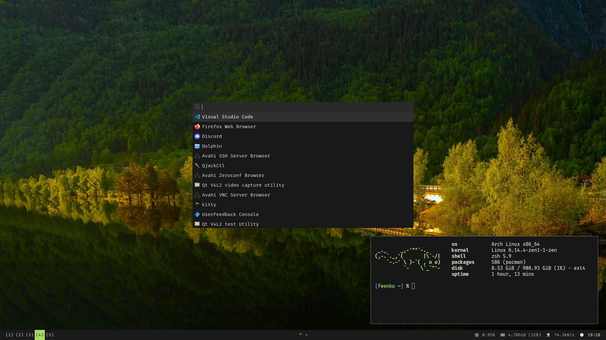

# martwypoeta/dots

My dotfiles for Arch with Hyprland. Everything here was mostly made by me, which means it can (and probably will) be dogwater.

## Screenshots

## Installation

If you really want to use it, just copy everything from this repo to your home folder **except**:

- `README.md`
- `screenshots/`

And install all required packages (I'm sure you can deduce everything from `.config`).
