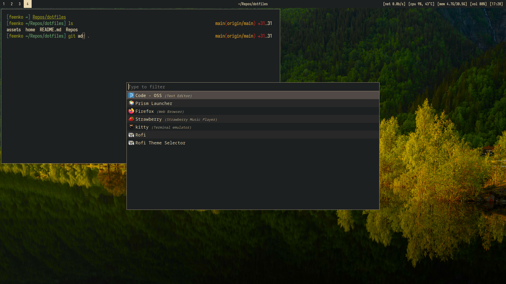

# martwypoeta/dotfiles

  

My personal Arch Linux dotfiles, now managed with [chezmoi](https://chezmoi.io/)

> [!NOTE]
> These dotfiles are provided as-is, without any warranty. Use at your own risk. I am not responsible for any damage or data loss resulting from their use.

## Preview

## Features

### Package Managers & Packages

- `Color`, `ILoveCandy` and `VerbosePkgLists` enabled in pacman configuration.
- [paru](https://github.com/Morganamilo/paru) AUR helper.
- Automated package installation. ([packages.yaml](./.chezmoidata/packages.yaml))

### Misc

- [PipeWire](https://github.com/PipeWire) audio stack.
- Unnecessary rofi entries hidden.

### Fonts

- [Noto Fonts](https://fonts.google.com/noto) suite for multilingual and emoji support.
- [Iosevka](https://github.com/be5invis/Iosevka) as primary monospace font.

## Usage

1. Install Arch Linux using [official Arch Linux installation guide](https://wiki.archlinux.org/title/Installation_guide)
  - For bootloader, preferably use [`systemd-boot`](https://wiki.archlinux.org/title/Systemd-boot)
  - For internet connection, use [`systemd-networkd`](https://wiki.archlinux.org/title/Systemd-networkd) along with [`systemd-resolved`](https://wiki.archlinux.org/title/Systemd-resolved)
  - For privilege escalation, use [`sudo`](https://wiki.archlinux.org/title/Sudo)
2. Install `chezmoi` package
3. Apply dotfiles using `chezmoi init --apply martwypoeta`

> [!NOTE]
> A folder named `Repos` should be created in your home directory, containing the `dotfiles` repository.
